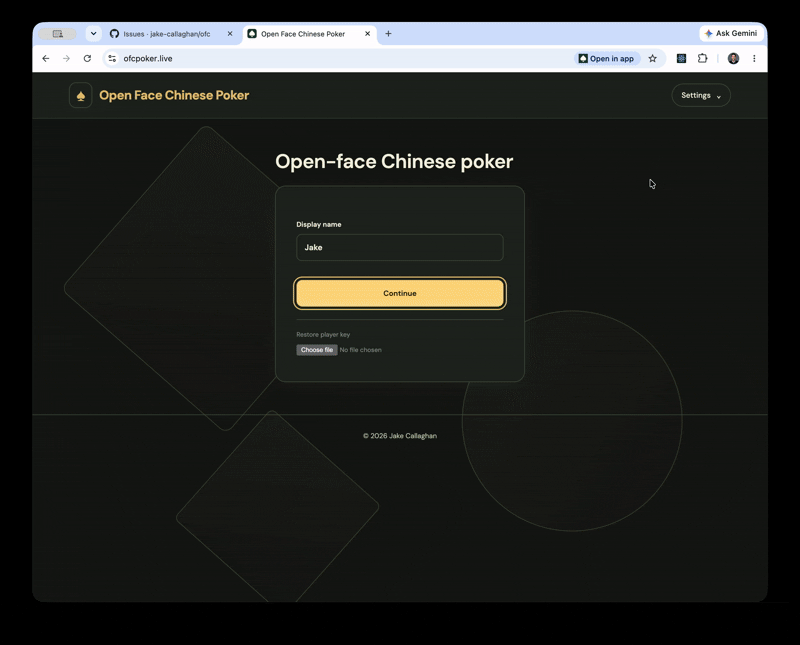

# Open Face Chinese Poker http://ofcpoker.live

Multiplayer OFC with Pineapple, Fantasyland, house-rule royalties and CPU practice. React frontend, Python/FastAPI backend, scores in units.

- [Backend](server/README.md)
- [Authentication setup](server/AUTH.md)
- [Frontend](frontend/README.md)
- [CPU reinforcement learning](training/README.md)

## Gameplay



## Development

Requires Python 3.13+, uv, Node 22.12+ and pnpm. Commands run from the repository root.

Backend: set `OFC_DATABASE_URL=sqlite:///data/ofc.sqlite3` in an ignored
`server/.env`, or use a dedicated development PostgreSQL database. Configure
Supabase login separately as described in [authentication setup](server/AUTH.md).

```sh
uv run --directory server python -m ofc.schema upgrade
uv run --directory server uvicorn ofc.api:app --reload
```

Frontend, in a second terminal:

```sh
pnpm --dir frontend install --frozen-lockfile
pnpm --dir frontend dev
```

Frontend: http://localhost:5173 · API docs: http://localhost:8000/docs

## Docker

```sh
docker build -t ofc .
docker run --rm -p 8080:8080 --env-file server/.env -v ofc_data:/data -e OFC_DATABASE_URL=sqlite:////data/ofc.sqlite3 ofc
```

App: http://localhost:8080 · API docs: http://localhost:8080/api/docs

One container serves the React build, API and WebSockets. Alembic migrations run
at startup before traffic is accepted.

## Fly.io

The `ofc` app runs as one server in London. SQLite game data, player mappings and
sessions live at `/data/ofc.sqlite3` on the persistent `ofc_local` volume.
Supabase still handles email/password authentication; it is not contacted for
every game action. See [authentication setup](server/AUTH.md).

The switch starts with an empty game database. Existing Supabase login accounts
remain, but users must sign in again and create new tables. Old games, history,
and local player IDs are not copied. The old PostgreSQL data is left untouched.

The GitHub production deployment stages `OFC_DATABASE_URL=sqlite:////data/ofc.sqlite3`
on Fly, overriding the old PostgreSQL secret. The Docker startup command checks
that `/data` is mounted, enables WAL, and runs migrations against the mounted file.
There is no Fly release command because release machines cannot mount the volume.

For a manual first cutover:

```sh
fly volumes create ofc_local --app ofc --region lhr --size 1
fly secrets set OFC_DATABASE_URL=sqlite:////data/ofc.sqlite3 --app ofc --stage
fly deploy --ha=false
```

Keep exactly one app Machine. Independent SQLite volumes do not share game state;
do not scale horizontally without adding database replication. Fly volume
snapshots provide recovery points, but a single Machine/volume has no live
failover. Back up the database with SQLite's backup API, rather than copying only
the database file while WAL writes are active.

Subsequent updates use `fly deploy --ha=false` or the GitHub workflow. The same
volume survives restarts and deployments; startup migrations preserve existing
rows. Status and logs are available with `fly status` and `fly logs`.
For isolated local tests, SQLite remains available only with an explicit
`OFC_DATABASE_URL=sqlite:///data/test.sqlite3`. Without configuration, startup
fails instead of silently creating a local database.

## Lobby access

Signed-in players can browse and watch every active table. New tables default to
Open, so anyone can join from the lobby or with an invite. Private tables are
also listed and watchable, but joining requires an invitation. Hosts can change
access between hands. Existing tables without an access setting remain Private.
Spectators receive no private draws, discards, unrevealed Fantasyland boards, or
member chat; joining a table makes a player eligible for a future hand.
